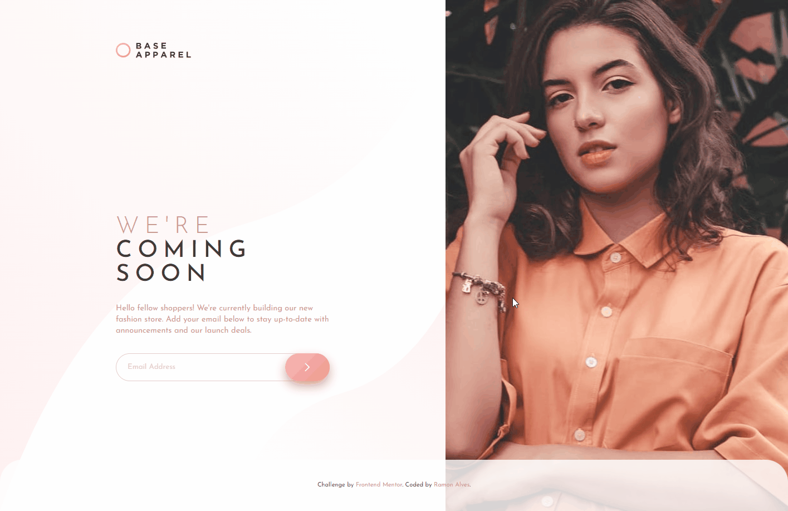

# Frontend Mentor - Base Apparel coming soon page solution

This is a solution to the [Base Apparel coming soon page challenge on Frontend Mentor](https://www.frontendmentor.io/challenges/base-apparel-coming-soon-page-5d46b47f8db8a7063f9331a0). Frontend Mentor challenges help you improve your coding skills by building realistic projects. 

## Table of contents 📖

- [Overview](#overview)
  - [The challenge](#the-challenge)
  - [Screenshot](#screenshot)
  - [Links](#links)
- [My process](#my-process)
  - [Built with](#built-with)
  - [What I learned](#what-i-learned)
  - [Continued development](#continued-development)
  - [Useful resources](#useful-resources)
- [Author](#author)

## Overview 🔭

### The challenge 🏆

Users should be able to:

- View the optimal layout for the site depending on their device's screen size
- See hover states for all interactive elements on the page
- Receive an error message when the `form` is submitted if:
  - The `input` field is empty
  - The email address is not formatted correctly

### Screenshots 🎴🎥🎬

#### Desktop Preview


#### Active States Preview


#### Mobile Preview


### Links 🔗

- Solution URL: [Add solution URL here](https://your-solution-url.com)
- Live Site URL: [Site](https://ramon-alvez.github.io/Frontend-Mentor-Challenge-Base-Apparel-coming-soon/)

## My process 💻✒

### Built with 🧱🛠

- Semantic HTML5 markup
- CSS custom properties
- Flexbox
- CSS Grid
- Mobile-first workflow

### What I learned 📚

I learned how to prevent a form submit and how to submit him after validation, here is the func I used to it:

```js
form.addEventListener('submit', (event) => {
    event.preventDefault()
   
    if (email.value.length === 0 || !emailRejex.test(email.value)) addError()
    else {
        removeError()
        form.submit()
    }
})
```

I know I have a lot to improve, but i'm really proud about this challenge, I tried to make sure to use GRID and do it as responsible as I could, so if anyone have tips or feedbacks I'm open to it.

### Continued development 🚀

Now my plan is to practice JS with Frontend Mentor challenges and continue studying React

### Useful resources 🎒

- [Example resource 1](https://horadecodar.com.br/como-parar-envio-de-formulario-com-javascript/) - This helped me for discovering `preventDefault()`, and later ChatGPT told me about `submit()`.

## Author 🧙‍♂️

- GitHub - [Ramon Alvez](https://github.com/Ramon-Alvez)
- Frontend Mentor - [@Ramon Alvez](https://www.frontendmentor.io/profile/Ramon-Alvez)
- LinkedIn - [@Ramon Alvez](https://www.linkedin.com/in/ramon-alvez/)